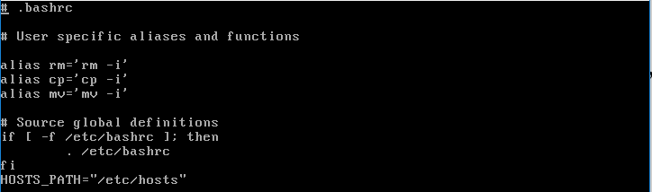
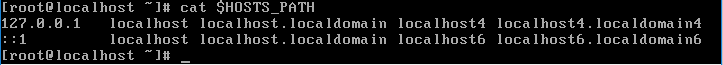

# ADT104137 - HW6
* 請在家目錄下的.bashrc裡新增一個shell變數 HOSTS_PATH=/etc/hosts，(注意不需用export)，說明如何不登出讓HOSTS_PATH變數生效，執行cat $HOST_PATH確認有讀取到檔案內容。
透過vi編輯
<pre><code># vi ~/.bashrc</code></pre>
輸入
<pre><code># HOSTS_PATH="/etc/hosts"</code></pre>
 
編輯完成後，按esc、輸入 :wq 存取並退出編輯模式 

輸入環境設定檔指令
<pre><code># source ~/.bashrc</code></pre>
最後以cat 確認有讀取到檔案內容
<pre><code># cat $HOSTS_PATH</code></pre>

