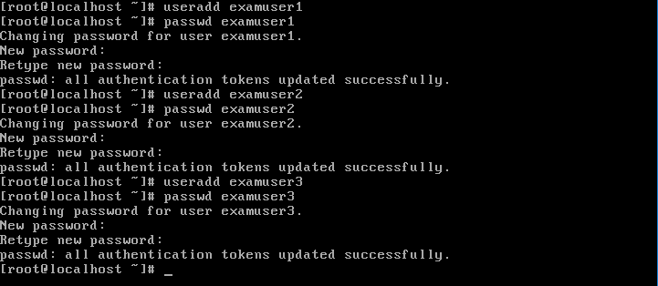
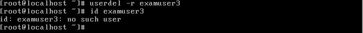
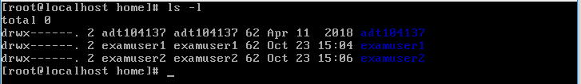
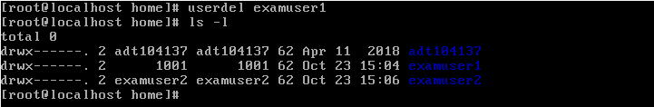

# ADT104137 - HW3
## 1.
### * 建立帳號名稱分別為 examuser1 ,examuser2 ,examuser3 的用戶，同時為這三個帳戶設定密碼 ItIsExam
<pre><code># useradd examuser1
# passwd examuser1</code></pre>
系統會詢問您想設定的密碼，輸入 IsItExam
<pre><code>New password:IsItExam(看不到)</code></pre>
再次確認密碼
<pre><code>Retype new password:IsItExam(看不到)</code></pre>

### * 刪除系統中examuser3的帳號，連同家目錄及郵件檔案同步刪除
<pre><code># userdel -r examuser3</code></pre>
在userdel指令中加入-r，會連同該帳號的家目錄及郵件檔案一同刪除 
輸入id指令查詢
<pre><code># id examuser3</code></pre>
 
轉換到home下查詢
<pre><code># cd /home
# ls -l</code></pre>
發現已經沒有之前新增的examuser3之目錄 

### * 刪除examuser1，但保留其家目錄及郵件檔案
<pre><code># userdel examuser1</code></pre>
刪除examuser1，但沒有在指令中加-r，保留了他的家目錄 
在home中查詢
<pre><code># ls -l</code></pre>
 
發現其家目錄由UID以及GID替代examuser1為使用者
