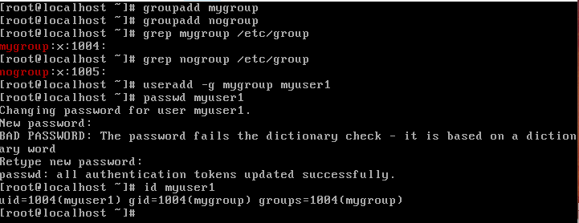

# ADT104137-HW4
## 1. 管理群組共用資料的權限設計
### * 建立群組名稱
<pre><code># groupadd mygroup
# groupadd nogroup</code></pre>
可用grep來搜尋檢查群組及GID
<pre><code># grep mygroup /etc/group</code></pre>
### * 建立帳號名稱、密碼，以及加入群組
創立使用者帳號時，同時加入群組
<pre><code># useradd -g mygroup myuser1</code></pre>
設定密碼
<pre><code># passwd myuser1</code></pre>
檢查使用者UID及GID
<pre><code># id myuser1</code></pre>
 
可檢視所有帳戶之UID及GID
<pre><code># cat /etc/passwd</code></pre>

### * 建立一個名為 /srv/myproject 的目錄，此目錄可以讓 mygroup 群組內的使用者完整使用，且【新建的檔案擁有群組】為 mygroup，其他人不能有任何權限
建立/srv/myproject
<pre><code># mkdir /srv/myproject</code></pre>
改變目錄的擁有群組
<pre><code># chgrp mygroup /srv/myproject</code></pre>
轉換到srv內對myproject的權限進行設定
<pre><code># cd /srv
#chmod 2770 myproject</code></pre>
2770的2是SGID設定，建立新檔案的群組與此目錄的群組相同 
檢查目錄權限
<pre><code># ls -ld myproject</code></pre>

